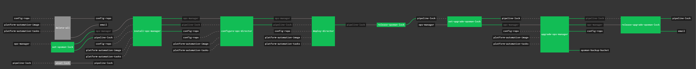

HOW TO USE
---

## Prerequisites
Install the following cli's
- jq
- yq
- ytt (v0.32.0+)

## Steps to execute

* Update the `create_pipeline.sh` script to update the `PIPELINE_DIR` variable to point to the desired folder
* Modify the script to your desired `config`, `pipelines` and `vars` folders
* Copy the `values.yml` to `values-env.yml`
* Update the `values-env.yml` to add the products you desire to be part of the pipeline
  ```
  products:
  - name: pks
    metadata:
      has_stemcell: True
      deploy_product: True                                                # Identify if the product is to be downloaded, deployed
      is_opsman: False                                                    # Identify if the product is OpsManager or not. Mostly false
      is_platform_automation: False                                       # Identify if the product is Platform Automation or not. Mostly false
    pivnet:
      slug: pivotal-container-service
      glob: '*.pivotal'                                                   # Enter the product glob
      version: ^1\.7\.[0-9]*$                                             # Update the product regex version
      stemcell_version: "621"                                             # Update the stemcell version
    s3:
      bucket: pks  
      stemcell_bucket: stemcells
      product_regex: "pivotal-container-service-(1.7.*).pivotal"       # Update the regex with the and update the version in the regex
  ```
* Execute the script now.

On execution, it will result in the follow directories:

```
.
├── config
│   ├── harbor
│   └── pks
├── env
├── pipelines
│   ├── download-products
│   │   ├── params-template.yml
│   │   └── pipeline.yml
│   ├── globals.yml
│   ├── ops-manager
│   │   ├── params-template.yml
│   │   └── pipeline.yml
│   ├── products
│   │   ├── params-template.yml
│   │   └── pipeline.yml
│   └── repave
│       ├── params-template.yml
│       └── pipeline.yml
└── vars
    ├── harbor
    └── pks

12 directories, 9 files
```

Now switch into the `pipelines` directory and fly the pipelines:

## Download Products

`fly -t dev sp -p download-products -c $PIPELINE_DIR/pipelines/download-products/pipeline.yml -l $PIPELINE_DIR/pipelines/download-products/params-template.yml -l $PIPELINE_DIR/pipelines/globals.yml`


## Install/Upgrade Ops Manager

`fly -t dev sp -p opsman -c $PIPELINE_DIR/pipelines/ops-manager/pipeline.yml -l $PIPELINE_DIR/pipelines/ops-manager/params-template.yml -l $PIPELINE_DIR/pipelines/globals.yml`




## Install/Upgrade Platform Products

`fly -t dev sp -p platform-products -c $PIPELINE_DIR/pipelines/products/pipeline.yml -l $PIPELINE_DIR/pipelines/products/params-template.yml -l $PIPELINE_DIR/pipelines/globals.yml`


## Repave Platform

`fly -t dev sp -p repave-platform -c $PIPELINE_DIR/pipelines/repave/pipeline.yml -l $PIPELINE_DIR/pipelines/repave/params-template.yml -l $PIPELINE_DIR/pipelines/globals.yml`


**NOTE: You will need to update the config, vars and also the params.yml file**
