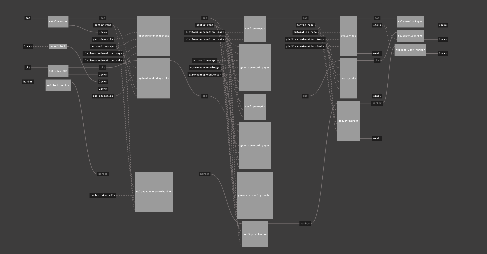

HOW TO USE
---

## Prerequisites
Install the following cli's
- jq
- yq
- ytt

## Steps to execute

* Update the `create_pipeline.sh` script to update the `PIPELINE_DIR` variable to point to the desired folder
* Modify the script to your desired `config`, `pipelines` and `vars` folders
* Update the `values.yml` to add the products you desire to be part of the pipeline
  ```
  products:
  - name: pas
    slug: ((pas_product_slug))
    version: ((pas_product_version))
    s3_bucket: ((s3_pas_bucket))
    s3_product_regex: "(.*).pivotal"
    s3_stemcells_regex: "(.*).tgz"
    has_stemcell: True
  ```
* Execute the script now.

On execution, it will result in the follow directories:

```
.
├── config
│   ├── compliance
│   ├── event-alerts
│   ├── harbor
│   ├── healthwatch
│   └── mysql
├── errands
│   ├── compliance
│   ├── event-alerts
│   ├── harbor
│   ├── healthwatch
│   └── mysql
├── pipelines
│   ├── params.yml
│   └── pipeline.yml
└── vars
    ├── compliance
    ├── event-alerts
    ├── harbor
    ├── healthwatch
    └── mysql

14 directories, 7 files
```

Now switch into the `pipelines` director and fly the pipeline:
`fly -t dev sp -p products -c $PIPELINE_DIR/pipelines/pipeline.yml -l $PIPELINE_DIR/pipelines/params.yml -l ../pipelines/globals.yml`




**NOTE: You will need to update the config, vars and also the params.yml file**
